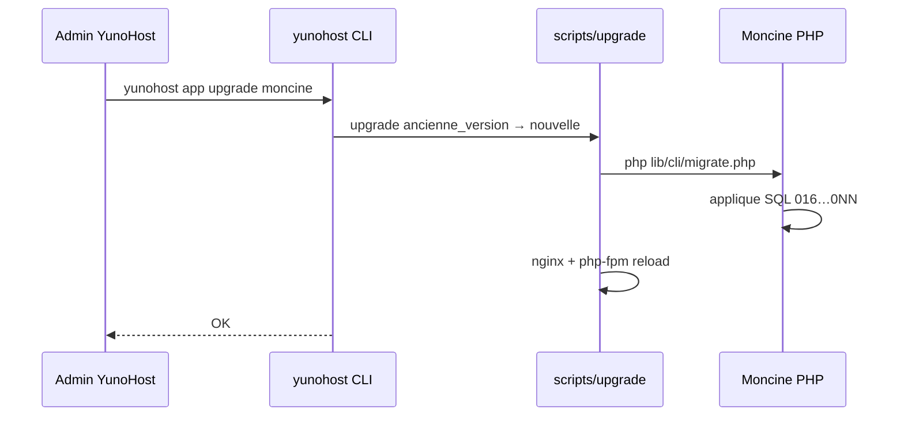
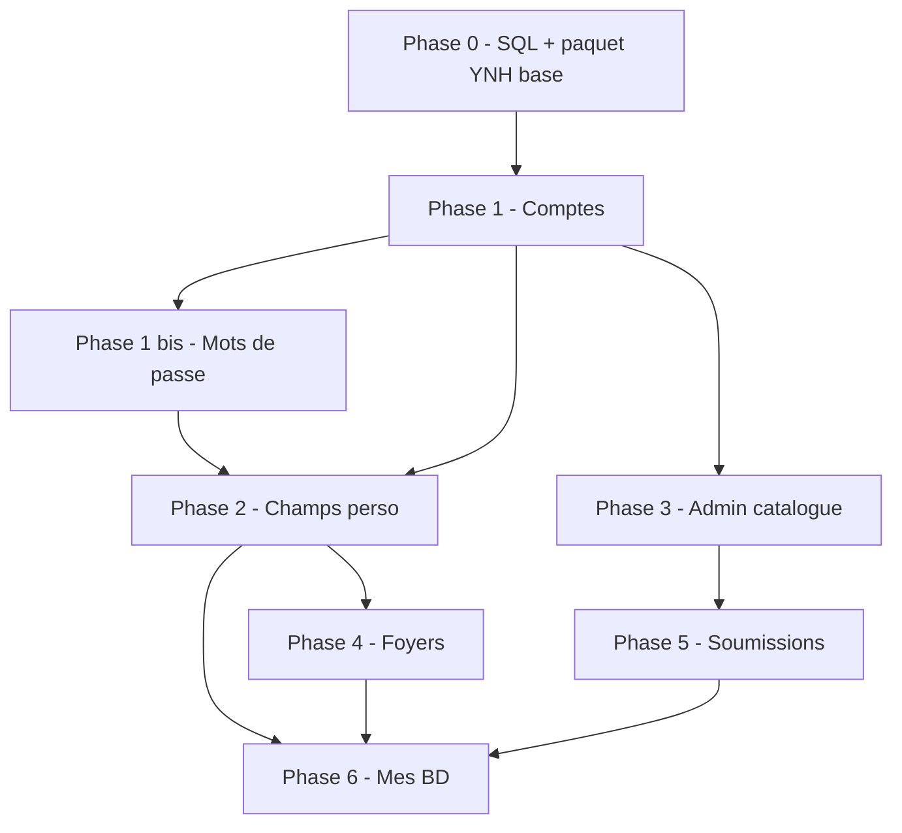

# Roadmap Moncine

Document de planification pour anticiper les prochaines évolutions, **y compris la publication en paquet YunoHost** avec mises à jour versionnées et **migrations SQL** sur les instances du paquet.

Les phases métier restent **ordonnées par dépendances** ; chaque version de paquet doit livrer une migration testée depuis la **version précédente du paquet**.

---

## Décision de déploiement : production actuelle figée

**Ce qui tourne aujourd’hui en production (My Webapp manuel) ne sera plus modifié ni mis à jour.**

| Environnement | Stratégie |
|---------------|-----------|
| **Production actuelle** | Gelée — correctifs urgents seulement si indispensable ; pas de nouvelles features |
| **Développement** | Uniquement vers le **paquet YunoHost** et le schéma cible |
| **Passage des données** | À la fin : **export** depuis l’ancienne instance → **import** dans la nouvelle (pas de migration SQL directe depuis l’ancienne `moncine.db`) |

Conséquences pour la roadmap :

- **Pas d’obligation** de migrer en place une base SQLite 015 → schéma multi-comptes sur le serveur actuel
- Les fichiers `sql/migrations/002–015` restent l’**historique** du dépôt dev ; le paquet partira d’un **`schema.sql` à jour** + migrations **nouvelles** (001+ du paquet ou 016+ renommées proprement)
- Il faudra prévoir un **export / import fiable** (CSV étendu ou outil dédié) couvrant films, envies, historique, métadonnées catalogue — à livrer avant la bascule
- Les upgrades YunoHost (`N → N+1`) concernent **uniquement** les instances installées via le paquet, pas l’ancienne prod

---

## Organisation du code : nouveau dossier (recommandé)

Travailler la version paquet dans un **dossier séparé** est une bonne idée, alignée avec la prod figée et l’export/import.

### Pourquoi séparer ?

| Avantage | Explication |
|----------|-------------|
| **Zéro risque** | Aucun changement accidentel sur ce qui tourne en My Webapp aujourd’hui |
| **Schéma neuf** | On peut repartir de `schema.sql` propre sans traîner 15 migrations historiques dans le chemin d’install |
| **Clarté** | Deux mondes : `legacy` = référence + export ; `app` = paquet YunoHost |
| **Paquet YunoHost** | Le dossier du paquet a une forme précise (`yunohost/`, `sources/`) — plus simple dans un arbre dédié |

### Structure recommandée (même dépôt git ou dépôt voisin)

**Option A — Monorepo (recommandée)** : un seul git, deux racines :

```text
Moncine/                    # dépôt git
├── legacy/                 # copie figée de la prod actuelle (plus de features)
│   ├── www/
│   ├── lib/
│   ├── sql/
│   └── README.md           # « lecture seule / export uniquement »
│
└── moncine-app/            # nouveau développement = sources du paquet
    ├── www/
    ├── lib/
    ├── sql/
    │   ├── schema.sql      # schéma cible complet
    │   └── migrations/     # 001, 002… uniquement paquet
    ├── yunohost/
    │   ├── manifest.toml
    │   └── scripts/
    └── doc/
        └── migration-export-import.md
```

**Option B — Deux dépôts** : `Moncine-legacy` (archivé) + `Moncine` (nouveau). Plus net si vous ne voulez plus jamais mélanger l’historique git.

### Ce qu’on fait concrètement

1. **Renommer / déplacer** l’existant vers `legacy/` (ou laisser la racine actuelle = legacy et créer `moncine-app/` à côté — selon votre habitude).
2. **Créer `moncine-app/`** en copiant seulement ce qui sert de base (pas `data/moncine.db`).
3. **Nettoyer** dans le nouveau dossier : pas de `UserContext` id 1, migrations reparties de zéro, `yunohost/` dès le début.
4. **Porter** les features utiles depuis `legacy/` par copie ciblée (écrans, TMDB…), pas par symlink automatique — pour éviter de réimporter les dettes.
5. L’**export** reste sur `legacy/` jusqu’à la bascule ; l’**import** est développé et testé dans `moncine-app/`.

### Ce qu’il ne faut pas faire

- Modifier `legacy/` pour les nouvelles features (sauf bug critique sur l’export).
- Partager `lib/` entre les deux dossiers via includes mélangés (confusion garantie).
- Copier `data/` ou la base SQLite dans le nouveau dossier versionné.

### Lien avec Cursor / l’IDE

Ouvrir le workspace sur **`moncine-app/`** (ou le dépôt parent avec les deux dossiers) pour que l’assistant et les outils ciblent le bon code.

---

## Principe directeur : penser « paquet YunoHost » dès maintenant

Aujourd’hui, Moncine est déployé à la main dans **My Webapp** (`www/` + `lib/` + `data/`). La cible est une **application YunoHost officielle** (ou communautaire) où :

- **`sources/`** du paquet = code PHP, templates, SQL (jamais la base utilisateur)
- **`data/`** sur le serveur = SQLite, clés API, affiches (hors git, sauvegardé à part)
- Chaque **mise à jour de paquet** exécute les **migrations SQL** manquantes, puis adapte la config (nginx, PHP)

Règles non négociables :

| Règle | Raison |
|-------|--------|
| Ne jamais écraser `data/moncine.db` à l’upgrade | Données utilisateur |
| Une migration = un fichier numéroté, idempotent si possible | Reproductibilité YNH |
| Version du **schéma** distincte de la version **affichée** de l’app | Savoir quoi migrer |
| Tester `N-1 → N` sur une base **paquet** (pas l’ancienne prod) | Upgrades YunoHost |
| Chemins via `MONCINE_DATA_PATH` (déjà en place) | Multi-installations |
| Bascule utilisateur = **export / import**, pas copie brute de `.db` | Schémas différents (comptes, foyers…) |

---

## Vision cible (fonctionnelle)

| Acteur | Capacités |
|--------|-----------|
| **Administrateur** | Gère le catalogue d’œuvres partagé (films, puis BD), valide les propositions, enrichit les fiches via TMDB |
| **Utilisateur** | Gère sa bibliothèque : collection du foyer, **sa** wishlist, **ses** notes et visions |
| **Sous-utilisateur « famille »** | Même collection physique que le foyer ; wishlist et historique **personnels** |
| **Tous** | Ne modifient pas les métadonnées catalogue — seulement les infos de **leur** exemplaire (`support`, format image/son, etc.) |

Fonctionnalités métier :

1. Comptes **admin** / **utilisateur** (connexion, gestion admin, **changement** et **réinitialisation** de mot de passe — voir phase 1 bis)
2. Foyers et sous-comptes **famille**
3. Page **Mes BD** (collection + wishlist)
4. **Soumissions** au catalogue (préremplissage → validation admin)

---

## État actuel (legacy — production figée)

Référence pour l’**export** au moment de la bascule, pas pour des upgrades SQL en prod :

- Schéma **catalogue + bibliothèque** (`oeuvres`, `bibliotheque`, `historique`)
- Migrations historiques **`002` → `015`** (dépôt dev uniquement)
- **Mes films** / **Mes envies**, import CSV, TMDB, statistiques, catalogue admin
- Mono-utilisateur (`UserContext` = id `1`)
- Déploiement **My Webapp** manuel (`README.md`)

**Le code neuf** ne part pas de cette base : il définit un schéma cible propre dans le paquet.

**Dettes résolues par le nouveau schéma (pas par migration depuis prod) :**

- `format_image` / `format_son` sur `bibliotheque` dès le schéma cible (phase 2)
- `historique.user_id` prévu avant livraison foyers (phase 4)
- Runner de migrations **propre** pour le paquet uniquement (phase 0)

---

## Stratégie SQL : migrations versionnées

### Tables de suivi (à renforcer en phase 0)

```sql
-- Déjà présent
schema_migrations (name TEXT PRIMARY KEY, applied_at)

-- À ajouter (migration 016)
app_metadata (
  key TEXT PRIMARY KEY,
  value TEXT NOT NULL
)
-- Clés : schema_version, legacy_user_migrated, …
```

- **`schema_version`** : entier = numéro de la dernière migration appliquée (ex. `15` aujourd’hui, puis `16`, `17`…)
- Conserver **`schema_migrations`** pour traçabilité fichier par fichier

### Convention pour les **nouvelles** migrations (à partir de 016)

| Règle | Exemple |
|-------|---------|
| Nom de fichier | `016_app_metadata.sql`, `017_utilisateurs_auth.sql` |
| Numéro sur 3 chiffres, croissant | Jamais modifier un fichier déjà publié dans un paquet |
| Une responsabilité par fichier | Auth ≠ foyers ≠ BD |
| SQL + commentaire en tête | `-- requires: schema_version >= 15` |
| Données : `INSERT…SELECT` explicite | Migration 013 = bon modèle |
| Colonnes SQLite | `ALTER TABLE` + gestion `duplicate column` (déjà partiel) |

### Migrations « données » sur instances **paquet** uniquement

| Événement | Stratégie |
|-----------|-----------|
| **Bascule depuis ancienne prod** | Export CSV (ou outil) → import sur paquet neuf — **pas** `cp moncine.db` |
| Install fraîche paquet | `schema.sql` complet + éventuellement seed admin |
| Upgrade paquet `N → N+1` | Fichiers SQL numérotés + `scripts/upgrade` |
| Données complexes (foyers) | SQL sur instance paquet ; re-import si besoin depuis export intermédiaire |

### Amélioration du runner (phase 0 — pour le paquet uniquement)

| # | Tâche |
|---|--------|
| 0.4 | Classe `SchemaMigrator` (transaction par fichier, log, `schema_version`) |
| 0.5 | Commande CLI `php lib/cli/migrate.php` (YunoHost + dev local) |
| 0.6 | **`schema.sql` = schéma cible v1 paquet** ; migrations incrémentales à partir de `001` ou `016` **paquet** |
| 0.7 | Tests : install vide → OK ; upgrade paquet `1.0 → 1.1 → 2.0` sur base paquet de test |
| 0.8 | Les migrations **002–015** restent dans le dépôt pour historique dev ; **hors** chemin upgrade paquet |

### Schéma cible simplifié (après toutes les phases)

```text
oeuvres              -- catalogue partagé (films, BD, …)
bibliotheque         -- lien foyer/user + statut + champs perso exemplaire
historique           -- visions + notes (+ user_id)
utilisateurs         -- comptes (role, foyer_id)
foyers               -- ménage / famille
catalogue_soumissions
schema_migrations
app_metadata
sessions             -- si sessions en base
```

---

## Stratégie paquet YunoHost

### Arborescence cible dans le dépôt

```text
Moncine/
├── lib/                    # code applicatif
├── www/
├── sql/
│   ├── schema.sql          # install fraîche uniquement
│   └── migrations/
├── yunohost/               # à créer (phase 0.9 ou 1.0 paquet)
│   ├── manifest.toml
│   ├── scripts/
│   │   ├── install
│   │   ├── upgrade
│   │   ├── backup
│   │   ├── restore
│   │   └── remove
│   └── conf/
│       ├── nginx.conf
│       └── php-fpm.conf    # MONCINE_DATA_PATH, etc.
└── doc/
    └── packaging.md        # procédure release (optionnel)
```

### Cycle de vie YunoHost



### Contenu des scripts

| Script | Rôle |
|--------|------|
| **install** | Créer `data/`, droits, admin initial (phase 1+), **ne pas** copier de `.db` |
| **upgrade** | `migrate.php` **systématique**, puis tâches données si version franchit un seuil |
| **backup** | Archive `data/` (db + posters + clés) |
| **restore** | Restauration `data/` puis `migrate.php` (schéma peut avoir avancé) |
| **remove** | Option conserver `data/` (déjà standard YNH) |

### Variables d’environnement (PHP-FPM)

Déjà partiellement prévu dans `lib/config.php` :

```bash
MONCINE_DATA_PATH=/var/www/moncine/data
MONCINE_TMDB_API_KEY=…   # optionnel : config panel YNH
```

Le panneau de config du paquet (manifest `config.toml`) exposera au minimum :

- Nom de l’instance / admin email (install)
- Clé TMDB (optionnel)
- (Plus tard) mode SSO YunoHost si choisi

### Authentification et YunoHost

| Option | Paquet | Recommandation |
|--------|--------|----------------|
| Session PHP + comptes Moncine | Compatible tous hébergements | **Phase 1** — défaut du paquet |
| Changement de mot de passe (utilisateur connecté) | Page « Mon compte » | **Phase 1 bis** — paquet **2.0.1** |
| Mot de passe oublié (e-mail + jeton) | SMTP YunoHost / `sendmail` | **Phase 1 bis** — paquet **2.0.1** |
| SSO / LDAP YunoHost | `use_sso` dans manifest | Phase ultérieure (optionnelle) |
| My Webapp password only | Aujourd’hui | Remplacé par login Moncine en 2.0 |

---

## Calendrier : versions paquet ↔ phases ↔ migrations

Chaque **version majeure de paquet** = une rupture de schéma ou de comportement testée. Les mineures = correctifs sans nouvelle migration.

| Version paquet | Version schéma | Phase | Migrations (nouvelles) | Contenu principal |
|--------------|----------------|-------|------------------------|-------------------|
| **1.0.x** | 1 (paquet) | 0 | `schema.sql` install fraîche | 1er paquet YNH : même features que legacy, schéma propre |
| **1.1.x** | 2 | 0 | `002_…` (paquet) | Runner migrations + export/import bascule documenté |
| **2.0.0** | 3–5 | 1 | `003_utilisateurs_auth`, … | Connexion, admin, comptes (install ou import post-bascule) |
| **2.0.1** | 5–6 | 1 bis | `004_password_reset_tokens.sql` (optionnel) | Changer son mot de passe ; réinitialisation oubliée |
| **2.1.0** | 20–21 | 2 | `020_format_exemplaire_bibliotheque`, `021_drop_oeuvre_format` | Champs perso vs catalogue |
| **2.2.x** | 21 | 3 | — ou `022_catalog_audit` | Outils admin catalogue |
| **3.0.0** | 22–25 | 4 | `022_foyers`, `023_bibliotheque_foyer`, `024_historique_user`, `025_wishlist_user` | Famille, collection partagée |
| **3.1.0** | 26 | 5 | `026_catalogue_soumissions` | Propositions utilisateurs |
| **4.0.0** | 27–29 | 6 | `027_oeuvres_bd`, `028_…` | Mes BD |

**Règle release :** les migrations SQL du paquet ne visent **pas** l’ancienne production My Webapp. La bascule passe par **export / import** une fois le paquet et l’outil d’import à jour.

**Livrable bascule (à planifier, ex. paquet 1.1 ou 2.0) :**

| # | Tâche export/import |
|---|---------------------|
| E.1 | Export complet depuis **legacy** : collection + envies + historique + champs œuvre |
| E.2 | Import dans paquet : mapping vers nouveau schéma (compte admin, foyer par défaut si 3.0) |
| E.3 | Guide utilisateur : « Migrer depuis Moncine My Webapp » (étapes, sauvegarde `data/`) |
| E.4 | Test bout en bout : prod figée exportée → paquet neuf importé → même nombre de films |

---

## Vue d’ensemble des phases (inchangée, enrichie)



---

## Phase 0 — Fondations SQL & paquet (prérequis YunoHost sérieux)

**Objectif :** pouvoir publier des upgrades sans casser les instances existantes.

| # | Tâche | Livrable paquet |
|---|--------|-----------------|
| 0.1 | Inventaire écrans `oeuvres` vs `bibliotheque` | Doc interne |
| 0.2 | Checklist régression (import, envies, enrichissement) | `doc/tests-manuels.md` |
| 0.3 | Lister dettes schéma (`historique.user_id`, etc.) | ROADMAP |
| 0.4–0.8 | **SchemaMigrator** + CLI + `016_app_metadata` | **Paquet 1.1.0** |
| 0.9 | Paquet YunoHost à la racine (`manifest.toml`, scripts, conf) | **Fait en dev** — voir `doc/packaging-yunohost.md` |
| 0.10 | `sources/` = copie propre sans `data/moncine.db` | `.gitignore` renforcé |
| 0.11 | Test upgrade paquet sur base créée par le paquet (pas ancienne prod) | Procédure release |
| 0.12 | Spécifier format export/import de bascule (livrable E.*) | Avant bascule utilisateur |

**Critère terminé :** install paquet + upgrade test OK ; export legacy → import paquet validé sur jeu de test.

---

## Phase 1 — Comptes, connexion et rôles → **paquet 2.0.0**

**Objectif :** fin du mono-utilisateur ; base pour familles et soumissions.

**Dépend de :** phase 0.

### Migrations SQL prévues

```text
017_utilisateurs_auth.sql
  - email, password_hash, role, actif, last_login_at
  - foyer_id NULL (colonne vide jusqu’à phase 4)

018_sessions.sql (si sessions en base)

019_seed_admin.sql (install uniquement, pas migration depuis ancienne DB)
```

### Développement

| # | Tâche | Paquet |
|---|--------|--------|
| 1.1 | Connexion / déconnexion | 2.0.0 |
| 1.2 | `UserContext` ← session | 2.0.0 |
| 1.3 | Protection pages + menu par rôle | 2.0.0 |
| 1.4 | Assistant **premier admin** (install YNH + page setup si DB vide) | 2.0.0 |
| 1.5 | CRUD utilisateurs (admin) | 2.0.0 |
| 1.6 | `canManageCatalog()` ← `role` | 2.0.0 |
| 1.7 | Durcissement sécurité (CSRF, limite connexion, hash, déconnexion POST) | 2.0.0 |

**Bascule depuis prod figée :** export legacy → import sur paquet 2.0 (compte admin créé à l’import ou au setup).

**Critère terminé :** deux comptes → deux bibliothèques distinctes ; import de test depuis export legacy OK.

**Déjà livré en dev (hors numérotation paquet) :** 1.1–1.7 partiellement (connexion, premier compte, admin comptes, suppression compte, durcissement session).

---

## Phase 1 bis — Mots de passe (compte personnel) → **paquet 2.0.1**

**Objectif :** chaque utilisateur gère son mot de passe sans passer par l’admin ; récupération en cas d’oubli.

**Dépend de :** phase 1 (2.0.0). **Peut être développée en parallèle de la phase 2** si les ressources le permettent, mais **release avant ou avec 2.1.0** recommandée (sécurité / confort).

### Migrations SQL prévues

```text
004_password_reset_tokens.sql (si stockage en base)
  - password_reset_tokens (
      user_id, token_hash, expires_at, created_at, used_at
    )
  - index sur token_hash, purge des jetons expirés à l’upgrade
```

Alternative sans table : jeton signé (HMAC + secret dans `data/`) avec expiration courte — à trancher en 1 bis.0 (doc technique).

### Développement

| # | Tâche | Paquet | Notes |
|---|--------|--------|--------|
| 1 bis.1 | Page **Mon compte** (profil : nom, e-mail affiché) | 2.0.1 | Lien menu utilisateur |
| 1 bis.2 | **Changer son mot de passe** (ancien + nouveau + confirmation) | 2.0.1 | CSRF ; invalider autres sessions si sessions en base (phase ultérieure) |
| 1 bis.3 | Admin : **réinitialiser** le mot de passe d’un compte (mot de passe provisoire affiché une fois) | 2.0.1 | Complète le « mot de passe provisoire » à la création |
| 1 bis.4 | **Mot de passe oublié** : formulaire e-mail → envoi lien | 2.0.1 | Message générique si e-mail inconnu (pas d’énumération) |
| 1 bis.5 | Page **Nouveau mot de passe** via jeton (expiration 1 h, usage unique) | 2.0.1 | Même règles 8–128 caractères que phase 1 |
| 1 bis.6 | Envoi e-mail via **SMTP YunoHost** ou `mail()` documenté | 2.0.1 | Tester sur instance YNH réelle |
| 1 bis.7 | Limite de débit sur « oublié » (comme `LoginThrottle`) | 2.0.1 | Par e-mail + IP |
| 1 bis.8 | Doc admin : configurer l’envoi mail sur le serveur | 2.0.1 | `doc/comptes-mot-de-passe.md` |

### Hors scope 2.0.1 (plus tard)

| Idée | Phase suggérée |
|------|----------------|
| Forcer changement au premier login (compte créé par admin) | 2.0.2 ou 1 bis.9 |
| Authentification à deux facteurs (2FA) | Hors périmètre court terme |
| Réinitialisation sans e-mail (code admin sur instance) | Option YNH si pas de SMTP |

**Critère terminé :** un utilisateur change son mot de passe ; un autre utilise « mot de passe oublié » et reçoit un lien valide ; jeton expiré ou réutilisé refusé.

---

## Phase 2 — Catalogue vs exemplaire personnel → **paquet 2.1.0**

**Dépend de :** phase 1.

### Migrations SQL prévues

```text
020_format_exemplaire.sql
  - ADD format_image, format_son ON bibliotheque
  - UPDATE … FROM oeuvres (via oeuvre_id)

021_cleanup_oeuvre_format.sql
  - (Option) conserver copies sur oeuvres pour admin ou les supprimer
```

| # | Tâche |
|---|--------|
| 2.1–2.5 | (inchangé) formulaires, blocage serveur, TMDB admin only |

**Critère terminé :** utilisateur modifie support/format ; pas le titre catalogue.

---

## Phase 3 — Admin catalogue → **paquet 2.2.x**

Outils admin, journal, fusion doublons. Migration optionnelle `022_admin_audit_log.sql`.

---

## Phase 4 — Foyers & famille → **paquet 3.0.0** (rupture schéma majeure)

**Migration la plus délicate** — prévoir fenêtre de maintenance et **backup obligatoire** dans `scripts/upgrade`.

### Migrations SQL prévues

```text
022_foyers.sql
023_bibliotheque_foyer_collection.sql
  - foyer_id sur entrées collection
  - UNIQUE (foyer_id, oeuvre_id) pour statut collection

024_historique_user_id.sql

025_wishlist_per_user.sql
  - Contrainte wishlist : UNIQUE (user_id, oeuvre_id)
```

### Script PHP post-SQL

- Regrouper les entrées `bibliotheque` collection du même ménage sous un `foyer_id`
- Dédupliquer si besoin

**Critère terminé :** upgrade 2.x → 3.0 sur base réelle de test ; wishlists séparées.

---

## Phase 5 — Soumissions catalogue → **paquet 3.1.0**

`026_catalogue_soumissions.sql` + UI. Aucune écriture directe dans `oeuvres` avant validation admin.

---

## Phase 6 — Mes BD → **paquet 4.0.0**

Extensions `moncine_kind` / métadonnées BD, pages dédiées, import CSV, soumissions BD.

---

## Checklist avant chaque release YunoHost

1. Numéro de version paquet et `schema_version` cible documentés dans ce fichier  
2. Fichiers SQL nouveaux uniquement (jamais modifier 002–015 publiés)  
3. Test **install fraîche** (schéma vide → dernière migration)  
4. Test **upgrade** depuis paquet N-1 avec DB réelle anonymisée  
5. Test **backup / restore** + migrate  
6. Notes de version YunoHost (`README_fr.md` du paquet) : migrations, actions manuelles éventuelles  
7. Vérifier que `data/` et `moncine.db` ne sont pas dans l’archive `sources`  

---

## Décisions techniques à trancher tôt

| Sujet | Recommandation pour le paquet |
|-------|-------------------------------|
| Authentification | Session PHP + `password_hash` (défaut) |
| Collection foyer | `foyer_id` sur `bibliotheque` (collection) |
| Wishlist | `user_id` personnel |
| BD | Même table `oeuvres`, type `bd` |
| SSO YunoHost | Option ultérieure dans `manifest.toml` |
| Install vs My Webapp | Paquet dédié `moncine` ; doc migration depuis My Webapp (copier `data/`) |

---

## Bascule depuis la production actuelle (export / import)

**Pas de copie directe de `moncine.db`** vers le paquet : les schémas divergeront (comptes, foyers, champs déplacés).

Procédure cible :

1. Sur l’**ancienne prod figée** : export (CSV étendu et/ou sauvegarde `data/` pour les affiches)  
2. Installer le **paquet Moncine** (base vide, schéma à jour)  
3. Configurer admin / foyer selon la version du paquet  
4. **Importer** les données via l’outil prévu (page Importer enrichie ou import dédié « migration »)  
5. Recopier le dossier **`posters/`** si les chemins locaux sont utilisés  
6. Vérifier comptages (films, envies, historique) puis basculer l’URL / désactiver l’ancienne app  

Documenter dans le paquet : `doc/migration-export-import.md`.

Les **upgrades YunoHost** ultérieurs (2.0 → 3.0, etc.) restent des migrations SQL **sur la base du paquet**, pas sur l’ancienne prod.

---

## Hors périmètre (pour plus tard)

- Application mobile native  
- Sync multi-instances  
- Marketplace entre foyers  
- API publique  
- Authentification à deux facteurs (2FA) — après phase 1 bis  

---

## Suivi de la roadmap

```markdown
### Historique
- 2026-05-XX — Roadmap enrichie : paquet YunoHost + stratégie migrations SQL
- 2026-05-XX — Prod actuelle figée ; bascule par export/import (pas migration SQL legacy)
- 2026-05-XX — Recommandation : développement paquet dans un dossier séparé (`moncine-app/` ou dépôt neuf)
- 2026-05-XX — Dossier `Moncine/` = paquet ; `Moncine (origine)/` = prod figée ; phase 0 amorcée (SchemaMigrator, yunohost/)
- 2026-05-16 — Phase **1 bis** ajoutée (paquet 2.0.1) : changer son mot de passe, oublié par e-mail, reset admin
- 2026-05-16 — Phase **1 bis** livrée en dev : `mon-compte`, oublié, reset par jeton, admin « Réinit. MDP », migration `004`
- 2026-05-16 — Paquet YunoHost v2 finalisé à la racine du dépôt (install / upgrade / backup testables)
- 2026-05-16 — Phase **2** livrée en dev (paquet 2.1.0) : `format_image` / `format_son` sur `bibliotheque`, formulaire « mon exemplaire », TMDB enrich réservé admin
- (à compléter à chaque release)
```

---

## Liens utiles dans le code

| Sujet | Fichiers |
|-------|----------|
| Connexion DB + migrations | `lib/Database.php` |
| Chemins données (YNH) | `lib/config.php` (`MONCINE_DATA_PATH`) |
| Utilisateur courant | `lib/UserContext.php` |
| Connexion / session | `lib/Auth.php`, `lib/LoginThrottle.php` |
| Comptes (admin) | `www/utilisateurs.php`, `lib/UtilisateurRepository.php` |
| Mots de passe (phase 1 bis) | `www/mon-compte.php`, `www/mot-de-passe-oublie.php` |
| Format exemplaire (phase 2) | `sql/migrations/005_*.sql`, `lib/CatalogSchema.php` |
| Migration catalogue | `sql/migrations/013_catalogue_bibliotheque.sql` |
| Schéma neuf | `sql/schema.sql` |
| Déploiement manuel actuel | `README.md` |

---

*Dernière mise à jour : mai 2026 — document vivant : mettre à jour la table « versions paquet » à chaque release.*
